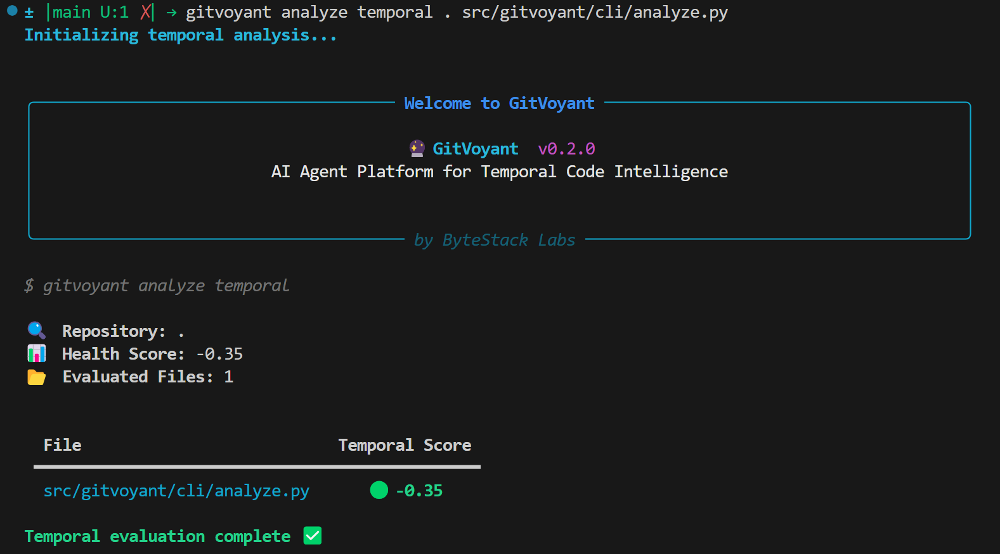
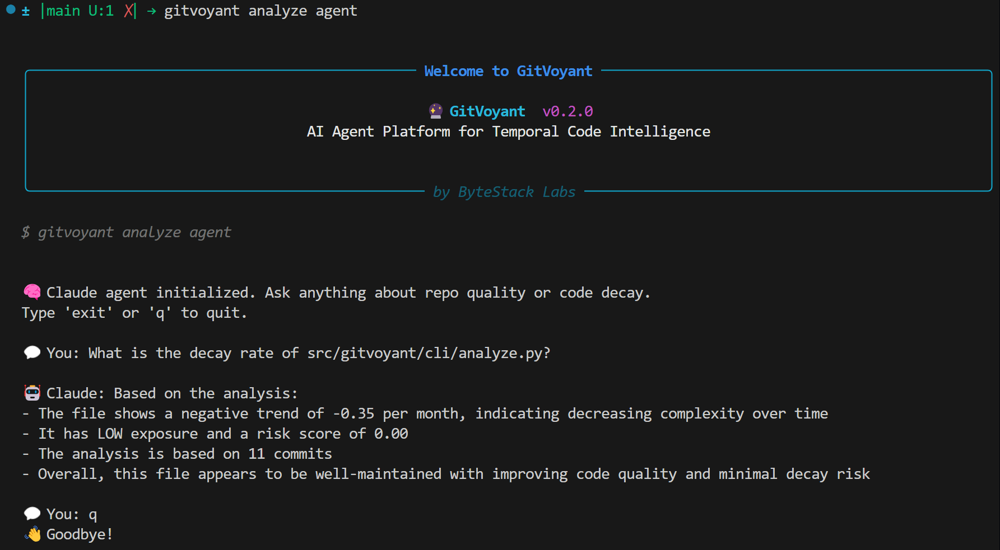

# 🧭 GitVoyant User Guide

🔮 **GitVoyant v0.2.0** - AI Agent Platform for Temporal Code Intelligence

*by ByteStack Labs*

---

## Visual Overview

_GitVoyant provides a Rich-formatted CLI experience:_

<p align="center">
  
</p>

---

## Overview

GitVoyant is a command-line tool that analyzes your Git repositories to understand how code complexity evolves over time. Using temporal intelligence and AI-powered analysis, GitVoyant helps you identify code decay patterns, quality trends, and maintenance hotspots before they become critical issues.

### Key Features

- **🎨 Rich CLI Interface**: Cyan banners, color-coded results, and emoji indicators
- **📊 Temporal Analysis**: Track how code complexity changes over time with statistical confidence
- **🧠 AI Agent Integration**: Interactive Claude AI agent for repository insights
- **🔍 Quality Decay Detection**: Identify files at risk of becoming maintenance burdens
- **🌐 Flexible Input**: Works with local repositories and remote Git URLs
- **⚡ Auto-Caching**: Intelligent repository cloning and caching for remote sources

---

## 📦 Installation

### Prerequisites

GitVoyant requires **Python 3.11+** and uses UV for fast Python package management. 

**Install UV:**
```bash
curl -LsSf https://astral.sh/uv/install.sh | sh
```

**Install Python 3.11+ (if needed):**
You can install it via [`pyenv`](https://github.com/pyenv/pyenv) or your OS package manager.

### Quick Setup

1. **Clone and bootstrap** (recommended for first-time setup):
   ```bash
   git clone https://github.com/Cre4T3Tiv3/gitvoyant.git
   cd gitvoyant
   make bootstrap
   ```
   This will:
   - Create a `.venv` using `uv`
   - Install core and CLI dependencies
   - Setup the CLI (`gitvoyant`) in editable mode

2. **Activate the environment**:
   ```bash
   source .venv/bin/activate
   ```
   
   Or add this to your `.bashrc` / `.zshrc`:
   ```bash
   export PATH="$(pwd)/.venv/bin:$PATH"
   ```

3. **Enable shell autocompletion** (optional but recommended):
   ```bash
   gitvoyant install-completion
   ```
   Follow the printed instructions to enable it for your shell permanently.

---

## 🛠️ Makefile Command Reference

### 🔧 Setup Commands

| Command | Description |
|---------|-------------|
| `make bootstrap` | 🔁 Create `.venv` and install all tools/dev deps |
| `make install` | 📦 Install core dependencies |
| `make dev` | 🧪 Install development dependencies |
| `make cli` | 📦 Install CLI entry point in editable mode |
| `make cli-complete` | 💻 Install CLI + shell autocompletion |
| `make completions-debug` | 🧪 Debug CLI app discovery for completion |

### 🧪 Development Workflow

| Command | Description |
|---------|-------------|
| `make lint` | 🔍 Run Ruff linting |
| `make format` | ✨ Format code using Ruff |
| `make test` | 🧪 Run all tests (unit, integration, CLI, coverage) |
| `make test-unit` | 🔬 Run unit tests |
| `make test-integration` | 🔗 Run integration tests |
| `make test-cli` | 💻 Run CLI-level tests |
| `make test-coverage` | 📊 Run tests with coverage report |

### 🧹 Utility & Debug

| Command | Description |
|---------|-------------|
| `make clean` | 🧹 Remove temp and build artifacts |
| `make version` | 📋 Show version and system info |
| `make check-path` | 🧪 Print current PYTHONPATH |
| `make check-uv` | 🔍 Ensure `uv` is installed |

---

## Usage

### Basic Commands

All GitVoyant commands start with the banner shown above.

#### Get Help
```bash
gitvoyant --help
```
Shows the main help screen with the available commands and options in a clean organized format.

#### Show Version
```bash
gitvoyant version
```
Displays the GitVoyant version information.

### Repository Analysis

GitVoyant provides two main analysis modes with Rich-formatted output:

## 📊 1. Temporal Analysis

<p align="center">
  
</p>

*The temporal analysis provides a complete view with the repository info grid and clean results table.*

Analyze how code complexity evolves over time in your repository.

**Analyze entire repository:**
```bash
gitvoyant analyze temporal /path/to/your/repo
```

**Analyze specific file:**
```bash
gitvoyant analyze temporal /path/to/repo src/main.py
```

**Analyze with custom time window:**
```bash
gitvoyant analyze temporal /path/to/repo --window-days 90
```

**Remote repository analysis:**
```bash
gitvoyant analyze temporal https://github.com/user/repo.git
```

### Understanding the Output Format

**🔮 GitVoyant Banner**: Welcome message with version and company info
**📊 Repository Info Grid**: 
- 🔍 **Repository**: Path or URL being analyzed
- 📊 **Health Score**: Overall repository health metric
- 📂 **Evaluated Files**: Number of files processed

**📋 Results Table**: Clean table with:
- File paths in cyan
- Color-coded temporal scores with visual indicators

### Understanding Temporal Scores

The temporal analysis produces **Temporal Scores** with intuitive visual indicators:

- **🟢 Green Circle**: Negative scores (e.g., -0.35) = **decreasing complexity over time (good!)**
- **🟡 Yellow Circle**: Near-zero scores (-0.25 to +0.25) = **stable complexity**
- **🔴 Red Circle**: Positive scores (>+0.25) = **increasing complexity (needs attention)**

### Remote Repository Handling

For remote repositories, GitVoyant automatically handles cloning with status messages:

```bash
⬇️  Cloning https://github.com/user/repo.git into /tmp/gitvoyant_project ...
```

Or for subsequent runs:
```bash
📦 Reusing existing clone: /tmp/gitvoyant_project
```

## 🧠 2. AI Agent Analysis

<p align="center">
  
</p>

*The AI agent provides natural language interaction for repository analysis.*

Launch an interactive AI agent session for conversational repository analysis.

```bash
gitvoyant analyze agent
```

**What You'll Experience:**
1. **🔮 GitVoyant Banner**: Same welcome message
2. **🧠 Agent Initialization**: "Claude agent initialized" with clear instructions
3. **💬 Interactive Conversation**: Natural language Q&A about your repository

**Example Conversation:**
```
💬 You: What is the decay rate of src/gitvoyant/cli/analyze.py?

🤖 Claude: Based on the analysis:
- The file shows a negative trend of -0.35 per month, indicating decreasing complexity over time
- It has LOW exposure and a risk score of 0.00
- The analysis is based on 11 commits
- Overall, this file appears to be well-maintained with improving code quality and minimal decay risk
```

**Agent Capabilities:**
- 📊 **Specific File Analysis**: Ask about individual files' decay patterns
- 🔍 **Repository Overview**: Get comprehensive health assessments
- 💡 **Recommendations**: Receive actionable insights for improvement
- 📈 **Trend Explanations**: Understand what temporal patterns mean

### Command Reference

#### Core Commands

| Command | Description |
|---------|-------------|
| `gitvoyant --help` | Show main help and available commands |
| `gitvoyant version` | Display version |
| `gitvoyant install-completion` | Setup shell autocompletion |

#### Analysis Commands

| Command | Description |
|---------|-------------|
| `gitvoyant analyze temporal <repo> [file]` | Run temporal complexity analysis |
| `gitvoyant analyze agent` | Launch interactive AI agent |

#### Temporal Analysis Options

| Option | Default | Description |
|--------|---------|-------------|
| `--window-days` | 180 | Days of commit history to analyze |

### Shell Autocompletion

Enable shell autocompletion for better CLI experience:

```bash
gitvoyant install-completion
```

**Expected Output:**
```
Detected shell: zsh
Run the following command to enable auto-completion temporarily:
    eval "$(gitvoyant --show-completion zsh)"

To make it permanent, add the above line to your shell config file:
    ~/.bashrc, ~/.zshrc, ~/.config/fish/config.fish, etc.
```

---

## 🎨 Visual Design Features

### Rich Terminal Experience
- **🎨 Cyan-Bordered Banners**: Consistent headers across all commands
- **📊 Color-Coded Results**: Intuitive green/yellow/red visual indicators
- **🔍 Emoji Icons**: Quick visual scanning with 🔍📊📂 indicators
- **📋 Clean Tables**: Formatting with proper alignment
- **⚡ Responsive Layout**: Automatically adapts to terminal width
- **✅ Status Messages**: Clear feedback with colored info/success/error messages

### CLI Design Philosophy
GitVoyant's CLI is designed with modern terminal aesthetics in mind:
- **Visual Hierarchy**: Clear separation between sections and information types
- **Accessibility**: High contrast colors and emoji for quick scanning
- **Terminal Adaptation**: Graceful handling of different terminal sizes

---

## Interpretation Guide

### Understanding Your Results

#### Health Score
The overall repository health score is calculated from all evaluated files. Higher positive scores indicate increasing complexity trends across your codebase.

#### Temporal Score Meanings

**🟢 Decreasing Complexity (Good)**
- Score: Negative values (< -0.25)
- Meaning: Code is becoming simpler over time
- Action: Continue current practices - you're doing well!

**🟡 Stable Complexity (Good)**
- Score: Near zero (-0.25 to +0.25)
- Meaning: Code complexity is stable
- Action: Monitor for changes

**🔴 Increasing Complexity (Attention Needed)**
- Score: Positive values (> +0.25)
- Meaning: Code is becoming more complex over time
- Action: Consider refactoring or closer review

#### Risk Factors to Watch

1. **High Positive Scores (>1.0)**: Files rapidly gaining complexity
2. **Files with Many Commits**: High-change files with positive trends
3. **Legacy Components**: Older files showing complexity increases

---

## Best Practices

### Regular Monitoring
- Run temporal analysis monthly on your main repositories
- Focus on files with the highest positive temporal scores
- Track trends over time to identify patterns

### Using the AI Agent
- Ask specific questions about problematic files
- Request recommendations for refactoring priorities
- Get explanations of complex temporal patterns

### Integration with Workflows
- Add GitVoyant analysis to your CI/CD pipeline
- Review temporal scores during code reviews
- Use results to prioritize technical debt

---

## Development Workflow

### For GitVoyant Contributors

#### Setup Development Environment
```bash
make bootstrap  # Full setup with virtual environment
make dev        # Install development dependencies
make cli        # Install CLI in editable mode
```

#### Development Commands
```bash
make lint       # Run code linting
make format     # Auto-format code
make test       # Run all tests
make clean      # Clean up cache files
```

#### Testing
```bash
make test-unit          # Unit tests only
make test-integration   # Integration tests only
make test-cli           # CLI tests only
make test-coverage      # Tests with coverage report
```

---

## Troubleshooting

### Common Issues

**"UV not found" Error**
```bash
# Install UV package manager
curl -LsSf https://astral.sh/uv/install.sh | sh
```

**Autocompletion not working?**
Run: `gitvoyant install-completion` and follow the shell-specific instructions.

**CLI not found after bootstrap?**
Add `.venv/bin` to your `PATH` or activate the virtualenv:
```bash
source .venv/bin/activate
```

**Python version issues?**
GitVoyant requires Python **3.11+**. You can install it via [`pyenv`](https://github.com/pyenv/pyenv) or your OS package manager.

**"Repository path does not exist"**
- Verify the path to your Git repository
- Ensure the directory contains a `.git` folder
- Check file permissions

**"Path is not a Git repository"**
- Initialize Git if needed: `git init`
- Verify you're in the correct directory
- Check if `.git` folder exists and is not corrupted

**Remote Repository Access Issues**
- Verify the Git URL is accessible
- Check network connectivity
- Ensure proper authentication for private repositories

**Python Path Issues**
```bash
# Check current Python path
make check-path

# Reset environment
make clean
make bootstrap
```

### Getting Help

1. **CLI Help**: Use `gitvoyant --help` for command information
2. **Verbose Output**: Most commands support verbose flags
3. **Log Files**: Check temporary directories for clone logs
4. **GitHub Issues**: Having issues? Feel free to open an [issue on GitHub](https://github.com/Cre4T3Tiv3/gitvoyant/issues)
5. **Support**: Reach out via [ByteStack Labs](https://bytestacklabs.com)

---

## Advanced Usage

### Custom Analysis Windows

Adjust the analysis timeframe based on your project's needs:

```bash
# Short-term trend (30 days)
gitvoyant analyze temporal ./repo --window-days 30

# Long-term trend (1 year)
gitvoyant analyze temporal ./repo --window-days 365
```

### Batch Analysis

Analyze multiple repositories:

```bash
#!/bin/bash
repos=(
    "https://github.com/org/repo1.git"
    "https://github.com/org/repo2.git"
    "./local/repo3"
)

for repo in "${repos[@]}"; do
    echo "Analyzing $repo..."
    gitvoyant analyze temporal "$repo"
    echo "---"
done
```

### CI/CD Integration

Example GitHub Actions workflow:

```yaml
name: Code Quality Analysis
on: [push, pull_request]

jobs:
  gitvoyant-analysis:
    runs-on: ubuntu-latest
    steps:
    - uses: actions/checkout@v3
      with:
        fetch-depth: 0
    
    - name: Install UV
      run: curl -LsSf https://astral.sh/uv/install.sh | sh
    
    - name: Setup GitVoyant
      run: |
        git clone https://github.com/Cre4T3Tiv3/gitvoyant.git
        cd gitvoyant
        make bootstrap
    
    - name: Run Temporal Analysis
      run: |
        cd gitvoyant
        .venv/bin/gitvoyant analyze temporal ${{ github.workspace }}
```

---

## API and Extensibility

GitVoyant is built with extensibility in mind. The core temporal evaluation service can be imported and used programmatically:

```python
from gitvoyant.domain.services.temporal_evaluator_service import TemporalEvaluatorService
import asyncio

async def analyze_repo():
    service = TemporalEvaluatorService()
    result = await service.evaluate_repository("/path/to/repo")
    print(result)

asyncio.run(analyze_repo())
```

---

## Contributing

GitVoyant is open source and welcomes contributions! See the main repository for contribution guidelines, development setup, and coding standards.

### Quick Contribution Setup
```bash
git clone https://github.com/Cre4T3Tiv3/gitvoyant.git
cd gitvoyant
make bootstrap
make dev
```

---

## License

GitVoyant v0.2.0 is licensed under Apache 2.0.

**🔮 GitVoyant** by [Jesse Moses (@Cre4T3Tiv3)](https://github.com/Cre4T3Tiv3) at [ByteStack Labs](https://bytestacklabs.com)

---

## 💬 Support

🧠 Built with purpose by Jesse Moses  
🔗 [@Cre4T3Tiv3](https://github.com/Cre4T3Tiv3) | [bytestacklabs.com](https://bytestacklabs.com)

*Happy analyzing! 🔮✨*

---